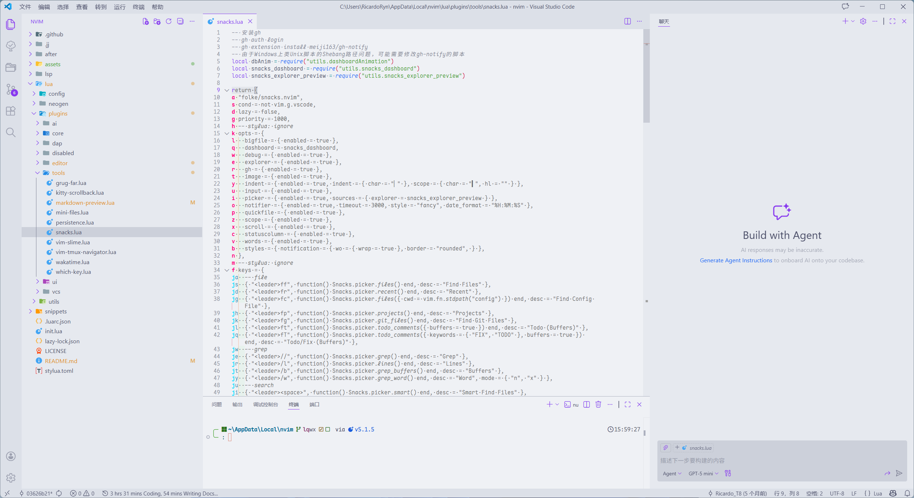

<div align="center">


# 🚀 My Neovim Configuration

_🍰 To be jj cake hand ✋._

[](https://neovim.io)
[](https://lua.org)
[](./LICENSE)

> **⚠️ Important**: This is **NOT** a Neovim distribution.
> It's my personal configuration that uses many plugins and custom settings.
> I'm sharing it to inspire others to build their own Neovim setup.
> Hope it helps!

</div>

---

## ✨ Features

<table>
  <tr>
    <td>
      <h3>🎨 Beautiful UI</h3>
      <ul>
        <li>Catppuccin theme</li>
        <li>Dashboard animations</li>
        <li>Colorful window separators</li>
        <li>Enhanced lualine</li>
      </ul>
    </td>
    <td>
      
    </td>
  </tr>
  <tr>
    <td>
      
    </td>
    <td>
      <h3>⚡ Superior Editing Experience</h3>
      <ul>
        <li>Autocompletion with blink.cmp</li>
        <li>Code navigation with Treesitter</li>
        <li>Motions with Flash & Hop</li>
        <li>Text objects & Surround operations</li>
      </ul>
    </td>
  </tr>
  <tr>
    <td>
      <h3>🤖 AI-Powered Development</h3>
      <ul>
        <li>AI code suggestions & NES</li>
        <li>AI-assisted refactoring</li>
        <li>AI snippet generation</li>
        <li>AI sidekick integration</li>
      </ul>
    </td>
    <td>
      
    </td>
  </tr>
  <tr>
    <td>
      
    </td>
    <td>
      <h3>🔍 Professional Debugging</h3>
      <ul>
        <li>DAP integration with UI</li>
        <li>Python debugging support</li>
        <li>Breakpoints & watch expressions</li>
        <li>Step-through debugging</li>
      </ul>
    </td>
  </tr>
</table>

### 🎯 Additional Highlights

- **🔥 Performance**: Lazy loading with lazy.nvim for instant startup
- **📝 Rich Editing**: Markdown preview, CSV viewer, and Jupyter notebook support
- **🌳 JJ Integrated**: Fully compatible with Jujutsu (jj) and Git version control
- **🔧 LSP & Formatting**: Full LSP support via Mason, plus conform.nvim and nvim-lint
- **🎯 Code Navigation**: Symbols outline, Trouble, Flash, and Hop for seamless movement
- **📦 Session Management**: Automatic session persistence
- **🎨 Syntax Highlighting**: Treesitter with rainbow delimiters & indentation guides
- **🔍 Search & Replace**: Powerful search via snacks.picker & Grug-far
- **🐍 Python Development**: Virtual env selector and REPL integration with vim-slime

---

## 📸 Screenshots

<div align="center">
  <figure>
    
    <figcaption>Copilot AI Intelligent Completion & Next Edit Suggestions</figcaption>
  </figure>

  <hr>

  <figure>
    
    <figcaption>Snacks Picker Fuzzy File Search</figcaption>
  </figure>

  <hr>

  <figure>
    
    <figcaption>Jujutsu Version Control System Integration</figcaption>
  </figure>

  <hr>

  <figure>
    
    <figcaption>Visual Diff Viewer</figcaption>
  </figure>

  <hr>

  <figure>
    
    <figcaption>Jupyter Notebook Integration (Bugs)</figcaption>
  </figure>
</div>

---

## 🗂️ Project Structure

```
~/.config/nvim/
├── init.lua                # Entry point
├── lazy-lock.json          # Plugin version lock file
├── stylua.toml             # Lua formatter config
├── .luarc.json             # Lua language server config
│
├── lua/
│   ├── config/             # Core configuration
│   │   ├── autocmds.lua    # Auto commands
│   │   ├── keymaps.lua     # Key mappings
│   │   ├── lazy.lua        # Lazy.nvim loader
│   │   ├── lsp.lua         # LSP configuration
│   │   └── options.lua     # Neovim options
│   │
│   ├── plugins/            # Plugin specifications
│   │   ├── ai/             # AI-related plugins
│   │   ├── core/           # Core plugins (blink, conform, mason, etc.)
│   │   ├── dap/            # Debug adapter protocol
│   │   ├── disabled/       # Disabled plugin configs
│   │   ├── editor/         # Editor enhancements
│   │   ├── tools/          # Development tools
│   │   ├── ui/             # UI plugins
│   │   └── vcs/            # Version control (git, jj)
│   │
│   ├── neogen/             # Neogen annotation templates
│   │
│   └── utils/              # Utility modules
│
├── after/                  # After plugins loaded
├── lsp/                    # LSP server custom configs
├── snippets/               # Custom snippets
└── assets/                 # Screenshots & images
```

---

## 💡 Installation & Usage

### Try It

If you want to try this configuration:

```bash
# required
mv ~/.config/nvim{,.bak}

# optional but recommended
mv ~/.local/share/nvim{,.bak}
mv ~/.local/state/nvim{,.bak}
mv ~/.cache/nvim{,.bak}

# Clone this configuration
jj git clone https://github.com/RicardoRyn/nvim.git ~/.config/nvim

# Start Neovim
nvim
```

After the first launch:

1. **Check plugins** with `:Lazy` to ensure all plugins are installed correctly
2. **Check health** with `:checkhealth` to verify system dependencies and LSP configuration
3. **Customize it** for your own needs!

### 💻 VSCode Neovim Integration

This configuration is fully compatible with [VSCode Neovim](https://github.com/vscode-neovim/vscode-neovim) (an extension of [VSCode](https://code.visualstudio.com/)), enabling Neovim-style modal editing in VSCode with compatible Neovim plugins.

> Personally, I need to edit Jupyter Notebooks,
> but Neovim's support for them is quite limited,
> so I have to use VSCode for that purpose.
> However, I've become so accustomed to Neovim's modal editing
> that I can't work efficiently without it.
> So I tried using Neovim within VSCode, and it works quite well.

<div align="center">

  <figure>
    
    <figcaption>Cursor Jumping in VSCode</figcaption>
  </figure>

  <hr>

  <figure>
    
    <figcaption>Nvim Plugins in VSCode</figcaption>
  </figure>
</div>

#### Setup

1. **Install the `VSCode Neovim` extension** from the VSCode Marketplace.
2. **Configure the extension** in your VSCode settings (`settings.json`):

   ```json
   {
     // vscode-neovim
     "vscode-neovim.neovimClean": false, // Don't clear Neovim configuration
     "extensions.experimental.affinity": {
       "asvetliakov.vscode-neovim": 1 // Neovim extension affinity
     },
     "vscode-neovim.compositeKeys": {
       "jk": {
         "command": "vscode-neovim.escape" // Composite key jk mapped to Escape
       }
     }
   }
   ```

3. For a better experience, some keybindings need to be configured in VSCode's `keybindings.json`. You can refer to my [settings](assets/Code/keybindings.json) for reference.

#### Available Features in VSCode

Since VSCode has its own built-in UI, terminal, and keybinding system, this configuration only enables efficiency-focused plugins that enhance the editing experience without conflicting with VSCode's native features:

- **lazy.nvim** - Plugin manager for lazy loading
- **mini.ai** - Enhanced text objects for smarter editing
- **mini.surround** - Quick surround operations (add/delete/change)
- **nvim-spider** - Smart word-wise navigation
- **nvim-treesitter-textobjects** - Treesitter-based text objects
- **flash.nvim & hop.nvim** - Fast cursor jumping
- **treesj** - Code splitting and joining utilities
- **yanky.nvim** - Enhanced clipboard with history

For the complete list of VSCode-specific keymaps, see the **[VSCode Keymaps](#vscode-keymaps)** section below.

---

## ⌨️ Keymaps

### Leader Keymaps

<details>
<summary> Click this </summary>

```
<leader>
├── <Space> (Smart Files)
├── a (AI)
│   ├── a - Toggle Sidekick CLI
│   ├── c - Toggle Sidekick Copilot
│   ├── d - Detach CLI Session
│   ├── f - Send File
│   ├── i - Toggle Sidekick iFlow
│   ├── p - Select Sidekick Prompt (including Visual mode)
│   ├── s - Select CLI
│   ├── t - Send This (including Visual mode)
│   └── v - Send Visual Selection (including Visual mode)
├── b (Buffer)
│   ├── a - Delete All Buffers
│   ├── b - Delete Picked Buffer
│   ├── d - Delete Buffer
│   ├── l - Delete Buffers Left
│   ├── o - Delete Other Buffers
│   ├── p - Toggle Pin
│   ├── r - Delete Buffers Right
│   ├── < - Move Buffer Left
│   └── > - Move Buffer Right
├── c (Copy/CSV)
│   ├── c - Copy Absolute Path (in Mini Files)
│   ├── d - Copy Directory Path (in Mini Files)
│   ├── f - Copy File Name (in Mini Files)
│   ├── r - Copy Relative Path (in Mini Files)
│   └── sv - Toggle CSV View
├── d (Debug)
│   ├── b - Breakpoint
│   ├── B - Conditional Breakpoint
│   ├── c - Run to Cursor
│   ├── C - Clear Breakpoints
│   ├── d - Disconnect
│   ├── D - Disconnect (Terminate Debuggee)
│   ├── h - Hover
│   ├── i - Step Into
│   ├── k - Step Back
│   ├── o - Step Over
│   ├── O - Step Out
│   ├── q - Terminate Session
│   ├── r - Restart
│   ├── R - Toggle REPL
│   ├── s - Start/Continue
│   ├── u - Toggle UI
│   └── f (Float)
│       ├── e - Float Expression
│       ├── f - Float Frames
│       ├── s - Float Scopes
│       ├── S - Float Sessions
│       └── t - Float Threads
├── e (Explorer)
│   ├── e - Mini Files
│   ├── f - Mini Files (Current File)
│   └── s - File Explorer (for Picture Preview)
├── f (Find)
│   ├── c - Find Config Files
│   ├── f - Find Files
│   ├── g - Find Git Files
│   ├── p - Projects
│   ├── r - Recent Files
│   ├── t - Todo (Buffers)
│   └── T - Todo/Fix (Buffers)
├── g (Git)
│   ├── b - Blame Line
│   ├── B - Blame Buffer
│   ├── p - Preview Hunk Inline
│   ├── P - Preview Hunk (Float)
│   ├── r - Reset Hunk
│   ├── R - Reset Buffer
│   ├── t - Toggle Current Line Blame
│   ├── w - Toggle Word Diff
│   ├── g - LazyGit
│   └── h (Github)
│       ├── i - GitHub Issues (Open)
│       ├── I - GitHub Issues (All)
│       ├── p - GitHub Pull Requests (Open)
│       └── P - GitHub Pull Requests (All)
├── h (Home)
├── j (Jujutsu)
│   ├── a - JJ Annotate File
│   ├── b (Bookmark)
│   │   ├── c - JJ Bookmark Create
│   │   ├── d - JJ Bookmark Delete
│   │   └── m - JJ Bookmark Move
│   ├── A - JJ Abandon
│   ├── C - Conflict
│   ├── d - JJ Diff Current Buffer
│   ├── D - JJ Describe
│   ├── e - JJ Edit
│   ├── f - JJ Fetch
│   ├── l - JJ Log (All)
│   ├── L - JJ Log
│   ├── n - JJ New
│   ├── r - JJ Rebase
│   ├── R - JJ Redo
│   ├── s - JJ Status
│   ├── S - JJ Squash
│   ├── U - JJ Undo
│   ├── p - JJ Push
│   └── t - JJ Tug
├── k (Kernel) (Only in Jupyter Notebook)
│   ├── 0 - Restart Kernel
│   ├── a - Insert Cell Above
│   ├── b - Insert Cell Below
│   ├── c - Clear Current Cell Output
│   ├── C - Clear All Outputs
│   ├── f - Toggle Cell Fold
│   ├── h - Inspect Variable at Cursor
│   ├── H - Toggle Auto-Hover
│   ├── i - Interrupt Kernel
│   ├── j - Open Cell Picker
│   ├── m - Convert to Markdown Cell
│   ├── n - Show Kernel Info
│   ├── o - Open Cell Output in Float
│   ├── r - Convert to Raw Cell
│   ├── s - Start Kernel
│   ├── S - Shutdown Kernel
│   ├── v - Show All Variables in Cell
│   ├── x - Execute Cell (Menu)
│   ├── X - Execute and Next (Menu)
│   └── y - Convert to Code Cell
├── l (LSP)
│   ├── a - Code Actions
│   ├── d - Show Diagnostics (Line)
│   ├── D - Show Diagnostics (Buffer)
│   ├── f - Code Format
│   ├── m - Toggle Code Block
│   ├── n - Generate Docstring
│   ├── r - Rename Symbol
│   ├── v - Virtual Env Selector
│   └── sp - Restart LSP
├── L (Lazy)
├── n (Noice)
│   ├── a - All
│   ├── e - Error
│   ├── h - History
│   ├── l - Last Message
│   ├── m - Messages
│   └── n - Noice Picker
├── o (Outline)
├── p (Paste)
├── s (Search/System)
│   ├── b - Buffers
│   ├── c - Commands
│   ├── d - Diagnostics (Buffer)
│   ├── D - Diagnostics
│   ├── h - Help Pages
│   ├── i - Icons
│   ├── I - Incoming Calls
│   ├── j - JJ Picker Status
│   ├── J - Jumps
│   ├── k - Keymaps
│   ├── l - Search for Plugin Spec
│   ├── L - LSP Info
│   ├── m - Marks
│   ├── O - Outgoing Calls
│   ├── p - Spelling
│   ├── P - Pickers
│   ├── r - Resume
│   ├── R - Search and Replace (Grug-far)
│   ├── s - LSP Symbols (Buffer)
│   ├── S - LSP Symbols (Workspace)
│   ├── t - Todo Comments
│   ├── T - Todo/Fix Comments
│   ├── u - Undotree
│   ├── v - Clipboard History
│   ├── " - Registers
│   ├── . - Scratch Select
│   └── / - Search History
├── S (Session)
│   ├── d - Don't Save Current Session
│   ├── l - Restore Last Session
│   ├── s - Restore Session
│   └── S - Select Session
├── t (Tab/Toggle)
│   ├── d - Close Tab
│   ├── n - New Tab
│   └── s - Tab Split
├── u (UI Toggle)
│   ├── b - Toggle Dark Background
│   ├── c - Colorschemes
│   ├── d - Toggle Diagnostics
│   ├── D - Toggle Dim
│   ├── g - Toggle Git Signs
│   ├── h - Toggle Inlay Hints
│   ├── l - Toggle Relative Number
│   ├── L - Toggle Line Number
│   ├── n - Noice Dismiss
│   ├── r - Redraw / Clear hlsearch / Diff Update
│   ├── w - Toggle Wrap
│   ├── z - Toggle Zoom
│   └── Z - Toggle Zen Mode
├── x (Trouble/QuickFix)
│   ├── l - LSP Definitions/References (Trouble)
│   ├── L - Location List (Trouble)
│   ├── Q - Quickfix List (Trouble)
│   ├── s - Symbols (Trouble)
│   ├── x - Diagnostics (Trouble)
│   └── X - Buffer Diagnostics (Trouble)
├── z (Zoxide)
├── . - Scratch
├── : - Command History
├── ? - Buffer Local Keymaps
└── / (Grep)
    ├── b - Grep Buffers
    ├── l - Lines
    ├── w - Grep Word
    └── / - Grep
```

</details>

### Other Keymaps

**Motion & Navigation**

- `jk` - Exit insert mode
- `s` - Flash jump/search
- `xw` / `xr` - Flash words/resume
- `xj` / `xk` / `xl` / `xh` - Hop navigation
- `Shift+h` / `Shift+l` - Previous/next buffer
- `Ctrl+h` / `Ctrl+j` / `Ctrl+k` / `Ctrl+l` - Navigate tmux windows
- `gd` / `gD` / `gr` / `gI` / `gy` - Goto definition/declaration/references/implementation/type
- `]d` / `[d` - Next/previous diagnostic
- `]g`/ `gh` / `[g` / `gH` - Next/previous git hunk

**Text Objects**

- `ciq`, `dab`, `yiw` - Enhanced text objects
- `gsaiw"`, `gsr'"`, `gsd'` - Surround operations

**Copilot**

- `Tab` - Goto/Apply next edit suggestion
- `Ctrl+y` / `Ctrl+w` - Accept Copilot suggestion/word
- `Alt+]` / `Alt+[` - Next/previous Copilot suggestion
- `Ctrl+]` - Dismiss Copilot suggestion

**Terminal**

- `Ctrl+/` / `Ctrl+_` - Open terminal

### VSCode Keymaps

```
<leader>
├── <Space> (Files) - Quick open file
├── ff / <Space> (Files) - Quick open file
├── aa (UI) - Toggle auxiliary bar
├── b (Buffer)
│   ├── d - Close buffer
│   ├── o - Close other buffers
│   ├── a - Close all buffers
│   ├── l - Close buffers to the left
│   ├── r - Close buffers to the right
│   ├── < - Move buffer left
│   └── > - Move buffer right
├── l (LSP)
│   ├── f - Format code
│   ├── r - Rename symbol
│   └── a - Code actions
└── o (Outline)
    ├── o - Focus outline
    └── v - Toggle outline visibility
```

**Motion & Navigation**

- `s` - Flash jump/search
- `xw` / `xr` - Flash words/resume
- `xj` / `xk` / `xl` / `xh` - Hop navigation
- `Shift+h` - Previous buffer
- `Shift+l` - Next buffer
- `Ctrl+w Ctrl+h` / `Ctrl+w Ctrl+j` / `Ctrl+w Ctrl+k` /`Ctrl+w Ctrl+l` - Navigate left/right windows (requires VSCode keybinding config)
- `Ctrl+o` - Navigate back
- `Ctrl+i` - Navigate forward
- `]d` - Go to next diagnostic
- `[d` - Go to previous diagnostic

**Editing**

- `Ctrl+d` / `Ctrl+u` - Move cursor down/up 5 lines
- `Ctrl+y` - Accept inline suggestion

**Text Objects**

- `ciq`, `dab`, `yiw` - Enhanced text objects
- `gsaiw"`, `gsr'"`, `gsd'` - Surround operations

**Jupyter Notebook Cell Operations**

- `l` - Edit current cell
- `y` - Copy cell
- `p` - Paste cell
- `Ctrl+Backspace` - Clear all cell outputs
- `Alt+Backspace` - Clear current cell outputs
- `Ctrl+j Ctrl+k` - Expand/collapse cell input
- `Ctrl+Shift+Alt+C` - Collapse all cell inputs
- `Shift+Alt+Backspace` - Restart kernel
- `Alt+h` / `Alt+l` - Fold/unfold notebook cell

**Terminal**

- `Ctrl+/` - Toggle built-in terminal
- `Ctrl+Shift+=` - Toggle maximized panel

---

<div align="center">

**⭐ If you find this config helpful, please give it a star! ⭐**

**💬 Feel free to open an [issue](https://github.com/RicardoRyn/nvim/issues) or submit a [PR](https://github.com/RicardoRyn/nvim/pulls) if you have any ideas or suggestions! 💬**

</div>
