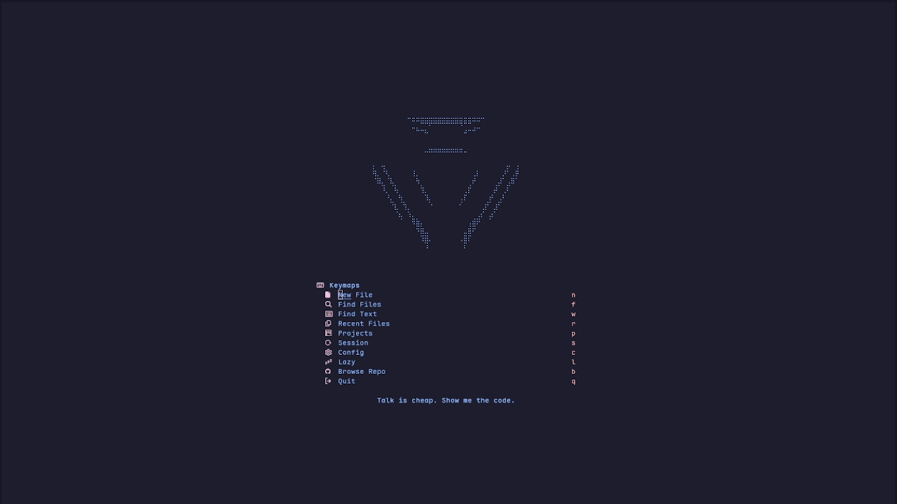
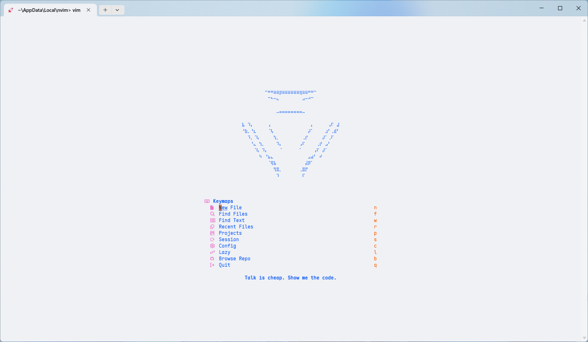
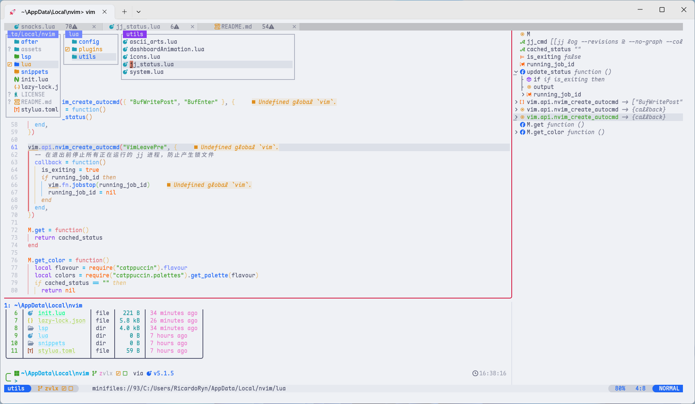
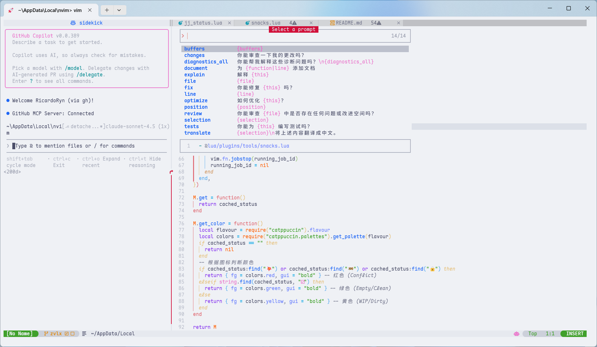
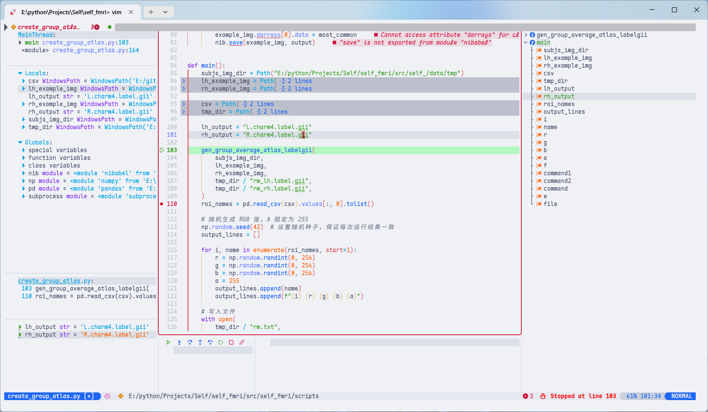
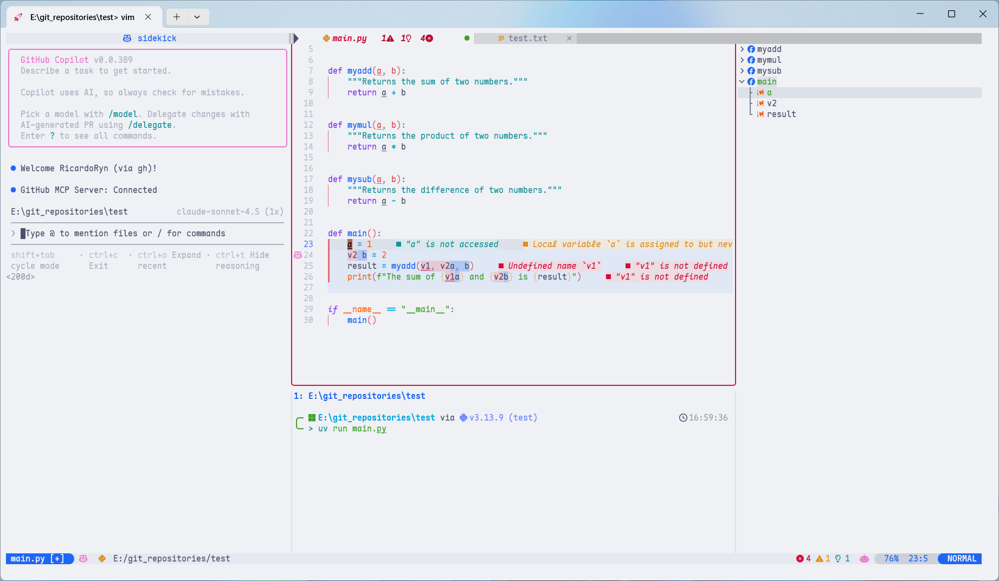
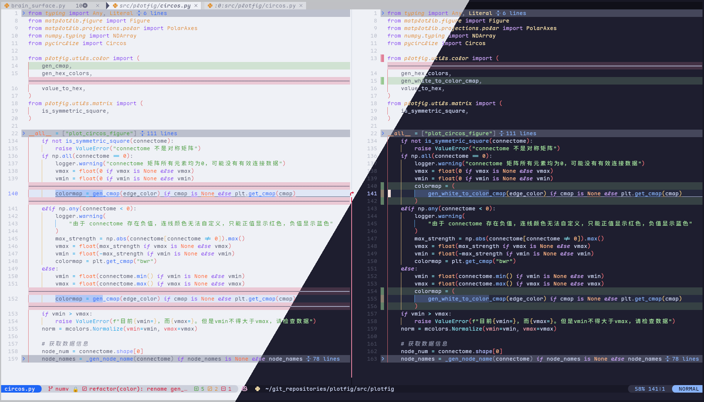
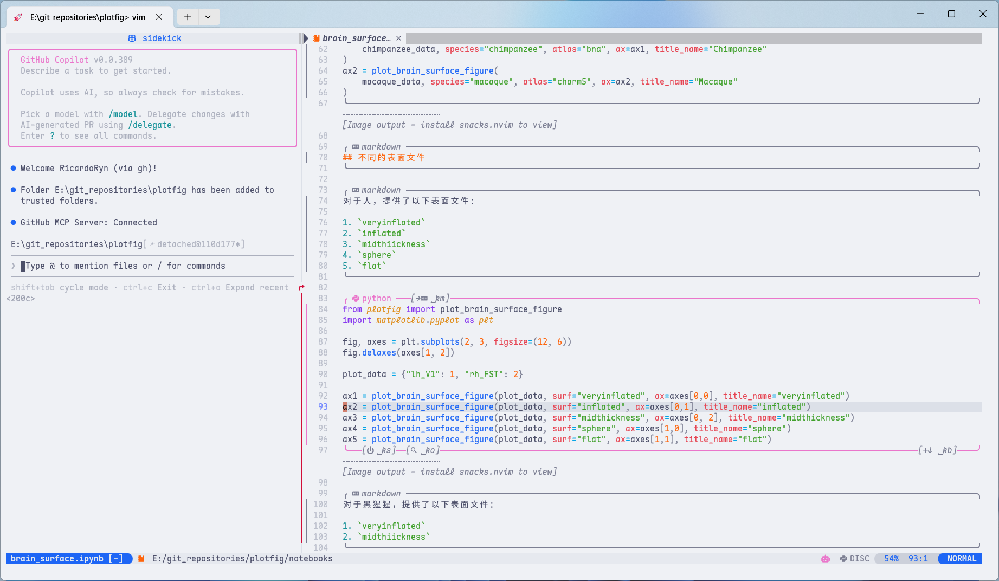
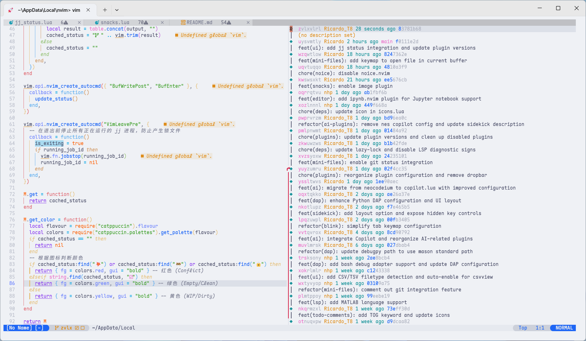
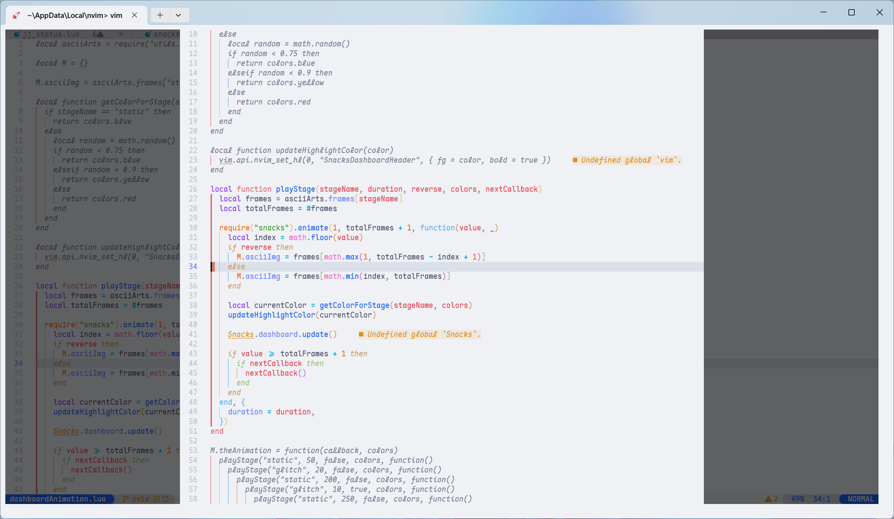

<div align="center">



# 🚀 My Neovim Configuration

_To be jj cake hand 🍰✋._

[](https://neovim.io)
[](https://lua.org)
[](./LICENSE)

</div>

---

## ✨ Features

<table>
  <tr>
    <td>
      <h3>🎨 Beautiful UI</h3>
      <ul>
        <li>Catppuccin theme</li>
        <li>Dashboard animations</li>
        <li>Colorful window separators</li>
        <li>Enhanced lualine</li>
      </ul>
    </td>
    <td>
      
    </td>
  </tr>
  <tr>
    <td>
      
    </td>
    <td>
      <h3>⚡ Superior Editing Experience</h3>
      <ul>
        <li>Autocompletion with blink.cmp</li>
        <li>Code navigation with Treesitter</li>
        <li>Motions with Flash & Hop</li>
        <li>Text objects & Surround operations</li>
      </ul>
    </td>
  </tr>
  <tr>
    <td>
      <h3>🤖 AI-Powered Development</h3>
      <ul>
        <li>AI sidekick integration</li>
        <li>AI code suggestions & NES</li>
        <li>AI-assisted refactoring</li>
        <li>AI snippet generation</li>
      </ul>
    </td>
    <td>
      
    </td>
  </tr>
  <tr>
    <td>
      
    </td>
    <td>
      <h3>🔍 Professional Debugging</h3>
      <ul>
        <li>DAP integration with UI</li>
        <li>Python debugging support</li>
        <li>Breakpoints & watch expressions</li>
        <li>Step-through debugging</li>
      </ul>
    </td>
  </tr>
</table>

### 🎯 Additional Highlights

- **🔥 Performance**: Lazy loading with lazy.nvim for instant startup
- **📝 Rich Editing**: Markdown preview, CSV viewer, and Jupyter notebook support
- **🌳 JJ Integrated**: Fully compatible with Jujutsu (jj) and Git version control
- **🔧 LSP & Formatting**: Full LSP support via Mason, plus conform.nvim and nvim-lint
- **🎯 Code Navigation**: Symbols outline, Trouble, Flash, and Hop for seamless movement
- **📦 Session Management**: Automatic session persistence
- **🎨 Syntax Highlighting**: Treesitter with rainbow delimiters & indentation guides
- **🔍 Search & Replace**: Powerful search via snacks.picker & Grug-far
- **🐍 Python Development**: Virtual env selector and REPL integration with vim-slime

---

## 📸 Screenshots

<div align="center">
  
  
  
  
  
  
</div>

---

## 💡 Usage & Inspiration

> **⚠️ Important**: This is **NOT** a Neovim distribution.
> It's my personal configuration that uses many plugins and custom settings.
> I'm sharing it to inspire others to build their own Neovim setup.
> Hope it helps!

### Getting Inspired

Feel free to explore the configuration and steal some ideas:

- Browse `lua/` for plugin configurations and custom settings
- Check `lsp/` for LSP server setups
- Look at `snippets/` for custom snippets
- Read `init.lua` to understand the overall structure

### If You Want to Try It

If you still want to test this configuration (keeping in mind it's tailored to my workflow):

```bash
# Backup your existing config
mv ~/.config/nvim ~/.config/nvim.bak
mv ~/.local/share/nvim ~/.local/share/nvim.bak
mv ~/.local/state/nvim ~/.local/state/nvim.bak
mv ~/.cache/nvim ~/.cache/nvim.bak

# Clone this configuration
jj git clone https://github.com/RicardoRyn/nvim.git ~/.config/nvim

# Start Neovim - plugins will install automatically
nvim
```

After the first launch:

1. **Install LSP servers** via `:Mason`
2. **Check health** with `:checkhealth`
3. **Customize it** for your own needs!

---

## 🗂️ Project Structure

```
~/.config/nvim/
├── init.lua                # Entry point
├── lazy-lock.json          # Plugin version lock file
├── stylua.toml             # Lua formatter config
│
├── lua/
│   ├── config/             # Core configuration
│   │   ├── autocmds.lua    # Auto commands
│   │   ├── keymaps.lua     # Key mappings
│   │   ├── lazy.lua        # Lazy.nvim
│   │   ├── lsp.lua         # LSP configuration
│   │   └── options.lua     # Neovim options
│   │
│   ├── plugins/            # Plugin specifications
│   │   ├── ai/             # AI-related plugins
│   │   ├── core/           # Core plugins
│   │   ├── dap/            # Debug adapter protocol
│   │   ├── editor/         # Editor enhancements
│   │   ├── tools/          # Development tools
│   │   ├── ui/             # UI plugins
│   │   └── vcs/            # Version control
│   │
│   └── utils/              # Utility functions
│
├── after/                  # After plugins loaded
├── lsp/                    # LSP custom configs
└── snippets/               # Custom snippets
```

---

<div align="center">

**⭐ If you find this config helpful, please give it a star! ⭐**

</div>
