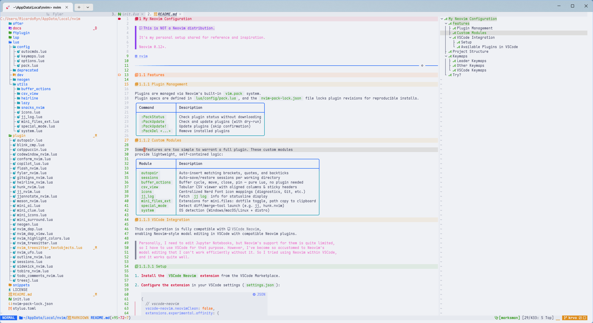

# My Neovim Configuration

> [!IMPORTANT] This is NOT a Neovim distribution.
>
> It's my personal setup shared for reference and inspiration.
>
> Neovim 0.12+.



## Features

### Plugin Management

Plugins are managed via Neovim's built-in `vim.pack` system.
Plugin specs are defined in `lua/config/pack.lua`.

| Command          | Description                             |
| ---------------- | --------------------------------------- |
| `:PackStatus`    | Check plugin status without downloading |
| `:PackUpdate`    | Check and update plugins (with dry-run) |
| `:PackUpdate!`   | Update plugins (skip confirmation)      |
| `:PackDel <...>` | Remove installed plugins                |

### Custom Modules

Some features are too simple to warrant a full plugin. These custom modules
provide lightweight, self-contained logic:

| Module           | Description                                               |
| ---------------- | --------------------------------------------------------- |
| `autopair`       | Auto-insert matching brackets, quotes, and backticks      |
| `sessions`       | Auto-save/restore sessions per working directory          |
| `buffer_actions` | Buffer cycle, move, close, pin — used by heirline tabline |
| `csv_view`       | Tabular CSV viewer with aligned columns & sticky headers  |
| `jj_log`         | Fetch `jj log` info for statusline display                |
| `special_mode`   | Detect diff/merge-tool launch (e.g. jj, hunk.nvim)        |
| `system`         | OS detection (Windows/macOS/Linux + distro)               |

### VSCode Integration

This configuration is fully compatible with [VSCode Neovim](https://github.com/vscode-neovim/vscode-neovim),
enabling Neovim-style modal editing in VSCode with compatible Neovim plugins.

> Personally, I need to edit Jupyter Notebooks, but Neovim's support for them is quite limited,
> so I have to use VSCode for that purpose. However, I've become so accustomed to Neovim's
> modal editing that I can't work efficiently without it. So I tried using Neovim within VSCode,
> and it works quite well.

#### Setup

1. **Install the `VSCode Neovim` extension** from the VSCode Marketplace.

2. **Configure the extension** in your VSCode settings (`settings.json`):

   ```json
   {
     // vscode-neovim
     "vscode-neovim.neovimClean": false,
     "extensions.experimental.affinity": {
       "asvetliakov.vscode-neovim": 1
     },
     "vscode-neovim.compositeKeys": {
       "jk": {
         "command": "vscode-neovim.escape"
       }
     }
   }
   ```

3. For a better experience, some keybindings need to be configured in VSCode's
   `keybindings.json`. See my [settings](docs/Code/keybindings.json) for reference.

#### Available Plugins in VSCode

Since VSCode has its own built-in UI, terminal, and keybinding system, this
configuration only enables efficiency-focused plugins that enhance the editing
experience without conflicting with VSCode's native features:

- **flash.nvim** - Fast cursor jumping
- **mini.ai** - Enhanced text objects for smarter editing
- **mini.surround** - Quick surround operations (add/delete/change)
- **nvim-treesitter-textobjects** - Treesitter-based text objects
- **treesj** - Code splitting and joining utilities

For the complete list of VSCode-specific keymaps, see [VSCode Keymaps](#vscode-keymaps) below.

## Project Structure

```text
~/.config/nvim/
├── init.lua                  # Entry point
├── nvim-pack-lock.json       # Plugin version lock
├── stylua.toml               # Lua formatter config
├── .luarc.json               # Lua LSP config
│
├── lua/
│   ├── config/               # Core configuration
│   │   ├── autocmds.lua      # Auto commands
│   │   ├── keymaps.lua       # Key mappings
│   │   ├── options.lua       # Neovim options
│   │   └── pack.lua          # vim.pack plugin specs
│   │
│   ├── dev/                  # Dev utilities (runtime path helpers, etc.)
│   ├── neogen/               # Neogen annotation templates
│   │   └── python/           # Python docstring templates
│   └── utils/                # Utility modules
│       ├── buffer_actions/   # Buffer management
│       ├── csv_view/         # CSV column-aligned view
│       ├── heirline/         # Heirline statusline/tabline components
│       ├── lazy/             # Lightweight lazy-loading for vim.pack
│       ├── snacks_nvim/      # Snacks.nvim configuration
│       ├── icons.lua         # Icon mappings
│       ├── jj_log.lua        # JJ log helpers
│       ├── mini_files_ext.lua# Mini.files extensions
│       ├── special_mode.lua  # Special mode detection (e.g. jj diff)
│       └── system.lua        # System detection (Windows/Mac/Linux)
│
├── plugin/                   # Per-plugin configs + custom scripts
│   ├── autopair.lua          # Autopair (custom)
│   ├── sessions.lua          # Session manager (custom)
│   └── ... (one file per plugin)
│
├── after/ftplugin/           # Filetype-specific settings (loaded after)
├── lsp/                      # LSP server custom configs
└── snippets/                 # Custom snippets
```

## Keymaps

Leader key is `<Space>`, and local leader key is `\`.

### Leader Keymaps

<details>
<summary> Click this </summary>

```text
<leader>
├── <Space> -- Smart find files
├── a (AI)
│   ├── a - Sidekick toggle
│   ├── d - Sidekick detach
│   ├── f - Sidekick send file
│   ├── p - Sidekick select prompt
│   ├── s - Sidekick select
│   ├── t - Sidekick send this
│   └── v - Sidekick send visual selection
├── b (Buffer)
│   ├── a - Buffer delete all
│   ├── b - Buffer delete pick
│   ├── d - Buffer delete
│   ├── l - Buffer delete left
│   ├── o - Buffer delete other
│   ├── p - Buffer pin toggle
│   ├── r - Buffer delete right
│   ├── < - Buffer move left
│   └── > - Buffer move right
├── d (Debug / DAP)
│   ├── b - Debug breakpoint
│   ├── B - Debug conditional breakpoint
│   ├── c - Debug run to cursor
│   ├── C - Debug clear breakpoints
│   ├── d - Debug disconnect (terminate debuggee)
│   ├── D - Debug disconnect
│   ├── h - Debug hover
│   ├── i - Debug step into
│   ├── k - Debug step back
│   ├── l - Debug launch OSV server
│   ├── o - Debug step over
│   ├── O - Debug step out
│   ├── q - Debug terminate session
│   ├── r - Debug restart
│   ├── R - Debug toggle REPL
│   ├── s - Debug start/continue
│   ├── u - Debug toggle UI
│   ├── v - Debug toggle virtual text
│   └── f (Float)
│       ├── e - Debug float expression
│       ├── f - Debug float frames
│       ├── s - Debug float scopes
│       ├── S - Debug float sessions
│       └── t - Debug float threads
├── D (Dev)
│   ├── m - Snacks metrics
│   ├── r - Snacks run lua
│   └── s - Snacks size
├── e (Explorer)
│   ├── e - Fyler
│   ├── f - Fyler (floating)
│   ├── r - Fyler (root path)
│   └── s - Files explorer
├── f (Find)
│   ├── c - Find config file
│   ├── f - Find files
│   ├── g - Find git files
│   ├── p - Find projects
│   ├── r - Find recent files
│   ├── t - Find todos in buffers
│   └── T - Find Todo/Fix in buffers
├── g (Git)
│   ├── b - Blame line
│   ├── p - Preview hunk
│   ├── P - Preview hunk (float)
│   ├── r - Reset hunk
│   ├── R - Reset buffer
│   ├── t - Toggle blame line
│   ├── w - Toggle word diff
│   └── h (GitHub)
│       ├── i - GitHub Issues (open)
│       ├── I - GitHub Issues (all)
│       ├── p - GitHub Pull Requests (open)
│       └── P - GitHub Pull Requests (all)
├── j (Jujutsu)
│   ├── a - JJ annotate
│   ├── A - JJ abandon
│   ├── b (Bookmark)
│   │   ├── c - JJ bookmark create
│   │   ├── d - JJ bookmark delete
│   │   └── m - JJ bookmark move
│   ├── B - JJ browse
│   ├── d - JJ diff current buffer
│   ├── D - JJ describe
│   ├── e - JJ edit
│   ├── f - JJ fetch
│   ├── l - JJ log all
│   ├── L - JJ log
│   ├── n - JJ new
│   ├── r - JJ rebase
│   ├── R - JJ redo
│   ├── s - JJ status
│   ├── S - JJ squash
│   ├── U - JJ undo
│   ├── p (Push / PR)
│   │   ├── l - JJ open PR listing available bookmarks
│   │   ├── p - JJ push
│   │   └── r - JJ open PR from bookmark in current revision or parent
│   └── t (Tag)
│       ├── d - JJ tag delete
│       ├── p - JJ tag push
│       └── s - JJ tag set
├── l (LSP)
│   ├── d - LSP diagnostics
│   ├── f - LSP format
│   ├── m - LSP toggle code block
│   ├── n - Generate docstring
│   ├── r - LSP restart
│   └── v - Virtual Env
├── m (Map)
│   ├── f - Map
│   └── m - Map
├── n - Notification
├── P (Pack)
│   ├── s - Pack status
│   ├── u - Pack update
│   └── U - Pack update (no confirmation)
├── s (Search)
│   ├── b - Search buffers
│   ├── c - Search commands
│   ├── d - Search diagnostics (buffer)
│   ├── D - Search diagnostics
│   ├── h - Search help pages
│   ├── i - Search icons
│   ├── I - Search incoming calls
│   ├── j - Search diff files
│   ├── J - Search jumps
│   ├── k - Search keymaps
│   ├── l - Search LSP info
│   ├── m - Search marks
│   ├── O - Search outgoing calls
│   ├── p - Search spelling
│   ├── P - Search pickers
│   ├── r - Search resume
│   ├── s - Search LSP symbols
│   ├── S - Search LSP Symbols in workspace
│   ├── t - Search todos
│   ├── T - Search todo/fix
│   ├── u - Undotree
│   ├── v - Search clipboard history
│   ├── " - Search registers
│   ├── . - Search scratch
│   ├── / - Search history
│   └── : - Search command history
├── t (Tab/Terminal)
│   ├── d - Tab delete
│   ├── f - Terminal float
│   ├── n - Tab new
│   ├── s - Tab split
│   ├── t - Terminal bottom
│   └── v - Terminal split
├── u (UI)
│   ├── b - Toggle background
│   ├── c - Select colorschemes
│   ├── d - Toggle diagnostics
│   ├── D - Toggle dim
│   ├── h - Toggle inlay hints
│   ├── l - Toggle relative number
│   ├── L - Toggle number
│   ├── m - Markdown preview
│   ├── n - Dismiss notifications
│   ├── r - UI redraw
│   ├── w - Toggle wrap
│   ├── z - Toggle zoom
│   └── Z - Toggle zen
├── z - Zoxide
├── . - Scratch
└── / (Grep)
    ├── b - Grep buffers
    ├── l - Grep lines
    ├── w - Grep word
    └── / - Grep
```

</details>

### Other Keymaps

**Motion & Navigation**

- `jk` - Exit insert mode
- `s` - Flash search
- `xw` / `xr` / `xj` / `xk` / `xl` / `xh` - Flash navigation
- `Shift+h` / `Shift+l` - Previous/next buffer
- `Ctrl+h` / `Ctrl+j` / `Ctrl+k` / `Ctrl+l` - Navigate tmux windows
- `]g` / `[g` / `gh` / `gH` `]G` / `[G` - Next/previous git hunk

**Text Objects & Editing**

- `ciq`, `dab`, `yiw` - Enhanced text objects (mini.ai)
- `gsaiw"`, `gsr'"`, `gsd'` - Surround operations (mini.surround)
- `E` / `B` - Go to end/beginning of line

**Copilot**

- `Tab` - Goto/apply next edit suggestion
- `Ctrl+y` / `Ctrl+w` - Accept suggestion/word
- `Esc` - Dismiss suggestion

**Terminal**

- `Ctrl+/` / `Ctrl+_` - Open terminal

### VSCode Keymaps

```
<leader>
├── <Space> / ff (Files) - Quick open file
├── aa (UI) - Toggle auxiliary bar
├── b (Buffer)
│   ├── d - Close buffer
│   ├── o - Close other buffers
│   ├── a - Close all buffers
│   ├── l - Close buffers to the left
│   ├── r - Close buffers to the right
│   ├── < - Move buffer left
│   └── > - Move buffer right
├── l (LSP)
│   ├── f - Format code
│   ├── r - Rename symbol
│   └── a - Code actions
└── o (Outline)
    ├── o - Focus outline
    └── v - Toggle outline visibility
```

**Motion & Navigation**

- `s` - Flash jump/search
- `xw` / `xr` - Flash words/resume
- `xj` / `xk` / `xl` / `xh` - Flash navigation
- `Shift+h` - Previous buffer
- `Shift+l` - Next buffer
- `Ctrl+h/j/k/l` - Navigate windows (requires VSCode keybinding config)
- `Ctrl+o` / `Ctrl+i` - Navigate back/forward

**Editing**

- `Ctrl+d` / `Ctrl+u` - Move cursor down/up 5 lines
- `Ctrl+y` - Accept inline suggestion

**Text Objects**

- `ciq`, `dab`, `yiw` - Enhanced text objects
- `gsaiw"`, `gsr'"`, `gsd'` - Surround operations

**Jupyter Notebook Cell Operations**

- `l` - Edit current cell
- `y` - Copy cell
- `p` - Paste cell
- `Ctrl+Backspace` - Clear all cell outputs
- `Alt+Backspace` - Clear current cell outputs
- `Ctrl+j Ctrl+k` - Expand/collapse cell input
- `Ctrl+Shift+Alt+C` - Collapse all cell inputs
- `Shift+Alt+Backspace` - Restart kernel
- `Alt+h` / `Alt+l` - Fold/unfold notebook cell

**Terminal**

- `Ctrl+/` - Toggle built-in terminal
- `Ctrl+Shift+=` - Toggle maximized panel

## Try?

```bash
# Backup existing config
mv ~/.config/nvim{,.bak}

# optional but recommended
mv ~/.local/share/nvim{,.bak}
mv ~/.local/state/nvim{,.bak}
mv ~/.cache/nvim{,.bak}

# Clone this configuration
jj git clone https://github.com/RicardoRyn/nvim ~/.config/nvim

# Start Neovim
nvim
```

After first launch:

1. Run `:checkhealth` to verify dependencies and LSP setup.
2. Run `:Mason` to install language servers and formatters.
3. Customize to your needs.

---

Feel free to open an [issue](https://github.com/RicardoRyn/nvim/issues) or submit a [PR](https://github.com/RicardoRyn/nvim/pulls) if you have suggestions.
